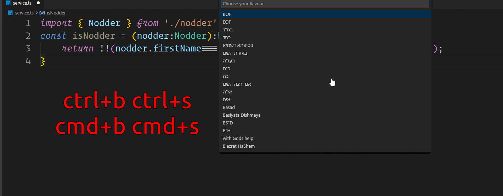

# Basadify 🙏🏻

> כי מי שמאמין לו מתעד

## בס"דיפיי זה תוסף לתוכנת ויז'ואל סטודיו קוד שמביא לכם קצת עזרה מבונה עולם

איך עושים?

מתקינים את התוסף בעורך דרך השוק מרקט של התוספים

פותחים קובץ קוד
לוחצים `ctrl+b ctrl+s / cmd+b cmd+s`
אפשר גם להריץ בס"דיפיי דרך `ctrl/cmd+shift+p ==> basadify`

בוחרים איזה סגנון רוצים לברכה - בס"ד, בסיעתא דשמיא, ב"ה ועוד - יש גם באנגלית וגם בארמית

מי שרוצה לתרום לתוסף זה חינם אין כסף מה שניקרא הקוד פתוח ברישיון של אפצ'י אז תעשו מזלג ותנו בכוכב למה אני הולך לקנות עם זה בית אחר כך

_שלכם לעד_

## חזי לפלסיאן 

[העמוד של התוסף בשוק של מיקרוסופט מערכות בע"מ](https://marketplace.visualstudio.com/items?itemName=hezylaplacian.basadify)

